---
#### Challenge
Create a button that represents another student in class (your "client"). The client should recognize themselves in the thing that has been created, and be delighted.
#### Problem Statement
From interviewing Lisa in class and on Slack, I could tell that she is a kind and timid individual. Also, she is extremely short for her age!
I wanted to take the challenge of making a statement for her own character. Although she is short and small, I wanted to show that 
she can be overwhelming for such a little individual. I wanted to create something small, but big, which incorporated music and things that she likes.
#### Interview
##### First Interview
I was completely in shock about doing an interview. I didn't know what to ask her! First we took things slow, and I got her birthday. 
From there, we went on a journey that was completely about Lisa. I learned about all of the things that she likes and why she likes them. I also learned about what music she listens too. Her favourite flower. Her favourite colour. Her love for corgis. 
We kept discussing herself until time was up.

By the end of the interview, I thought I would have gotten it all down, but I still didn't know what to make for her. 
One thing I knew for sure was that she is a quirky individual with a love for classical music and many interesting things.

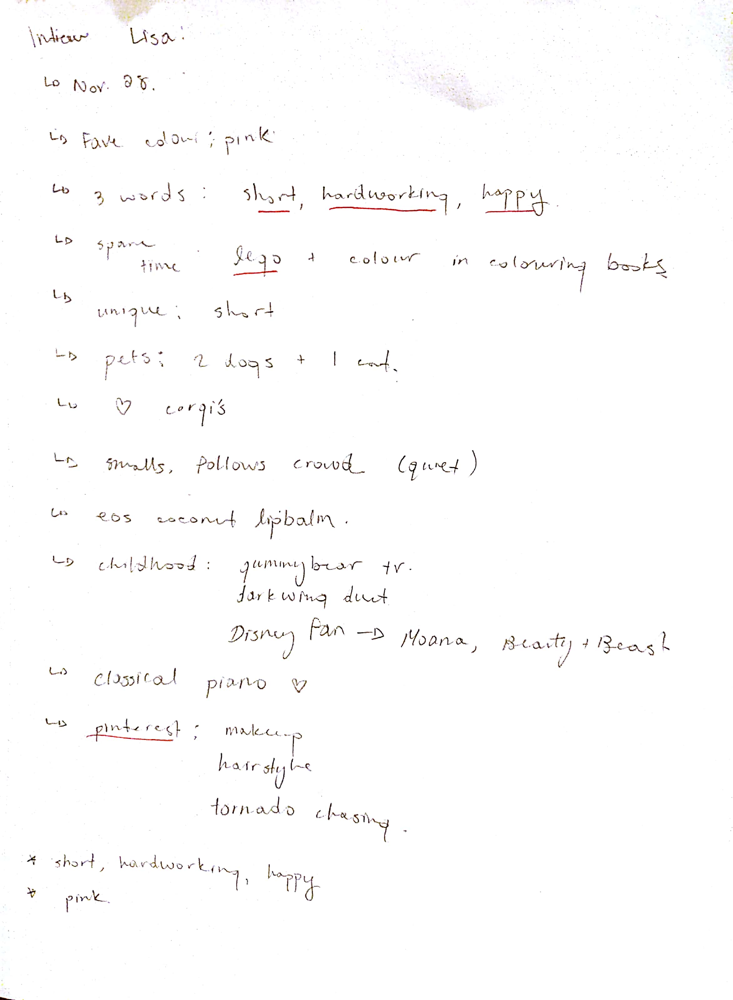

##### Second Interview
As I was working on the project, I wanted to get more information on what Lisa likes. I did a mini interview through Slack. This interview was really helpful because I found out that she likes camping, spaceships, and many more things. This gave me enough foundation to make my project head in a certain direction. 

This interview gave me different ideas for backgrounds, situations and music which would then be incorporated in my project. I learned that I should not rely on a single interview, and never be afraid to ask your client for more clarification. 

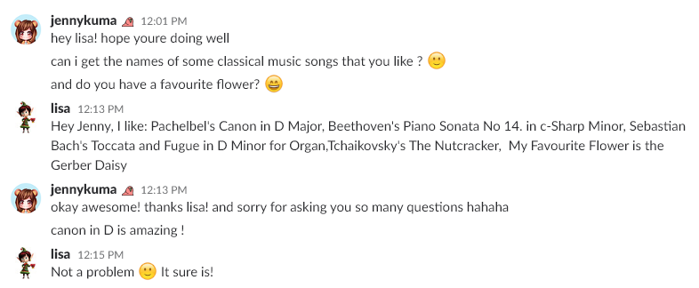

---
#### Low-Fi Prototyping - Sketches
##### Initial
| &nbsp; | &nbsp; | &nbsp; | &nbsp; | &nbsp; |
|:-:|:-:|:-:|:-:|:-:|
| 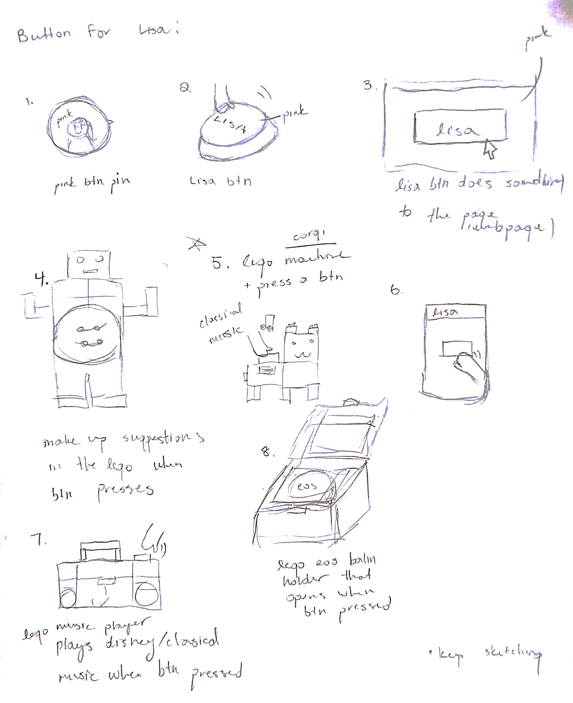 | 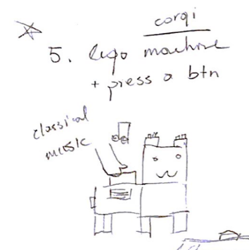 | 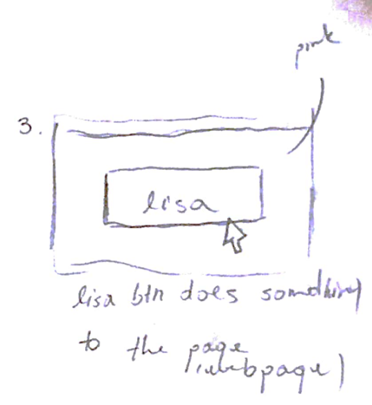 | 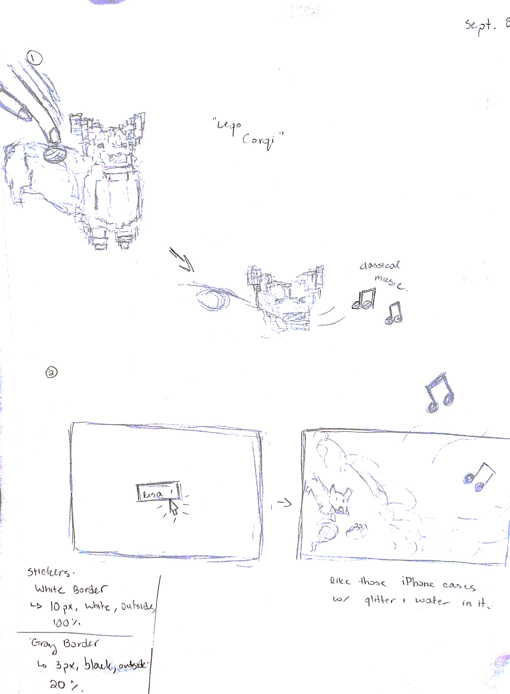 | 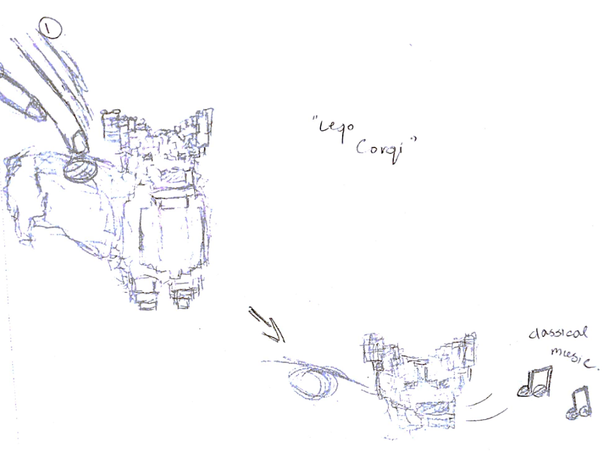
The first couple images are what I had envisioned what Lisa's button would look like: 
1. **A Pin** - I was thinking about the aestetics and how she could wear it. It could even look kind of flashy on her! 
2. **Lisa Button** - This was inspired by the Staples 'That was easy' button. I wanted it to play music or something like that. 
3. **WPF Lisa Button** - I wanted to make this a program which did something after pressing the button. This idea was later evolved into my final product. 
4. **Lego Warrior Lisa** - I added a dinky button onto this lego warrior which would then do something when it is pressed. 
5. **Lego Corgi** - I just wanted to build a lego corgi that played classical music when the button was pressed. 
6. **Mobile App Button** - A mobile app that would do something whenever she would press a button. I had a sound board in mind. 
7. **Lego Music Player** - I wanted a boombox that looked so thug, but when the button is pressed, it would spit out classical music. 
8. **Lego Box** - Lisa loves her EOS lip balm. I wanted to create a lip balm holder out of lego since she loves lego too. 

** Out of all of the sketches, Lego Corgi and the WPF Lisa Button stuck out to me the most.

##### Refinement
&nbsp; | &nbsp;
:-: | :-:
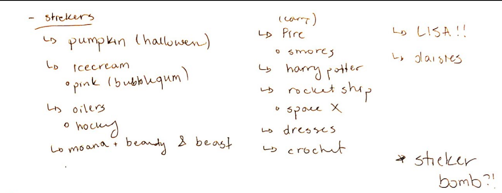  |  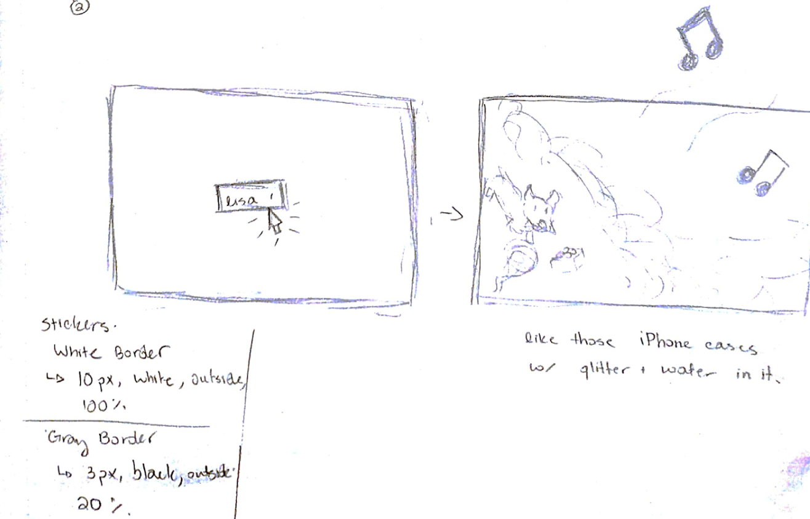

The above images display ideas about Lisa's button and a list of what could be turned into stickers. 

I later went onto refining the Lego Corgi. I literally thought it was going to be the best thing ever, but then I realized that our projects had to be implemented. So I jumped ship from the Lego Corgi onto a more viable option --> WPF. 

At first, I wanted a button that had her name on it and then she could press it and it would do something. But I then thought that this wouldn't be enough for a 500 level course project. So then I evolved the button into a corgi, because Lisa loves corgis. I wanted to create something animated, which then elevated to the adventure of a corgi. From there, I had the idea of adding stickers, which follows the 'Sticker Bomb' concept. Each sticker would be added into the animation and it would sort of tell a story with the song being played. 

Bam! I hit the jackpot. 
I came to realize that an animated story with the corgi as the button would best represent Lisa. It was almost as if she were in the story.

Since she is short and small, I wanted to create a small window which would then be filled with music, stickers of things that she likes and changing scenes that go along with the situation. To add to that, it would include fluidity and bounciness for her happy personality. 

Below are the storyboards I drew up for the animated story.

&nbsp; | &nbsp;
:-: | :-:
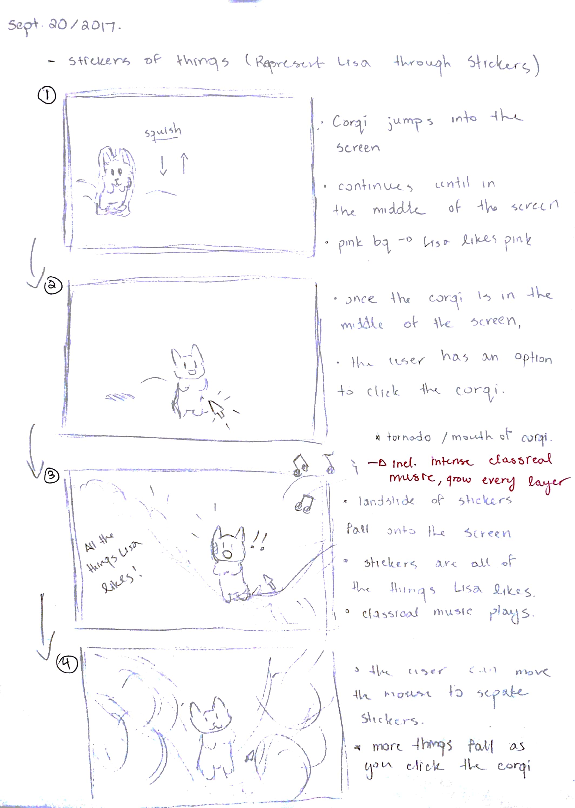  |  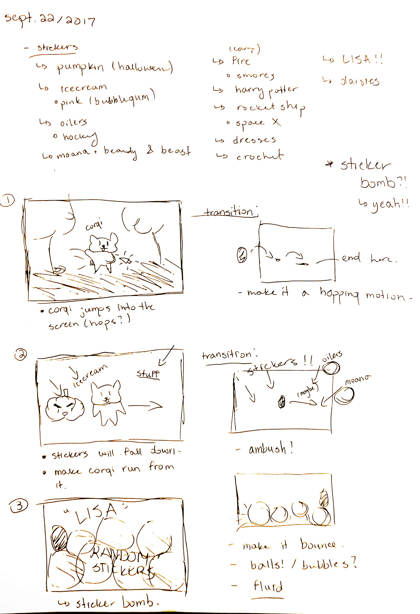

---
#### Code
##### Github
Github repository: <a href="https://github.com/Jennykuma/CPSC-581/tree/master/P0" target="_blank">Click here</a>

Github main source code: <a href="https://github.com/Jennykuma/CPSC-581/blob/P0/P0/ButtonP0_JennyLe/ButtonP0_JennyLe/MainWindow.xaml.cs" target="_blank">Click here</a>

Github repository (download as ZIP):  <a href="https://github.com/Jennykuma/CPSC-581/archive/P0.zip" target="_blank">Click here</a>

##### Download the Project
.exe download: <a href="https://www.dropbox.com/s/d6g6kw4m1035163/CPSC581-P0-JennyLe.zip?dl=0" target="_blank">Click here</a>

.exe Instructions:
- Download the following .zip file
- Unzip it to your desired location
- Open up the folder and run the .exe file
- The corgi is your button for the entire program. Enjoy!  

Credits: <a href="https://www.dropbox.com/s/7d5d3cmmg1s4ql2/P0%20Bibliography.txt?dl=0" target="_blank">Click here</a>

---
#### Working Prototype
youtube: <a href="https://www.youtube.com/watch?v=fq5kMB8Lftc" target="_blank">https://www.youtube.com/watch?v=fq5kMB8Lftc</a>