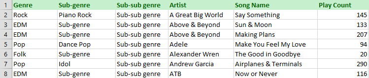
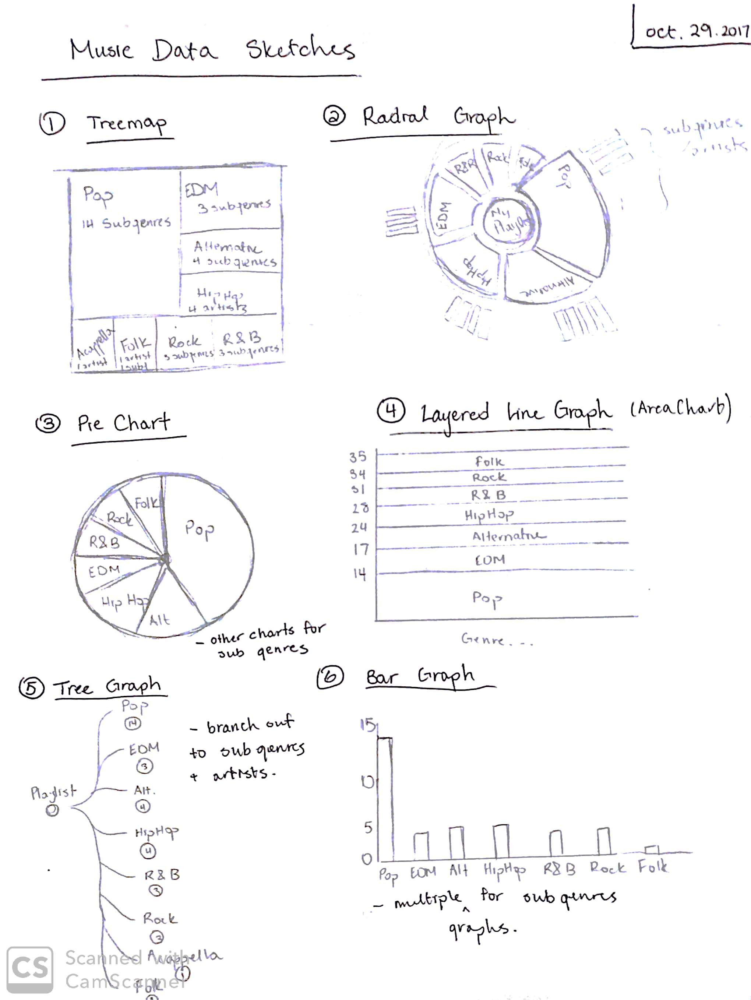
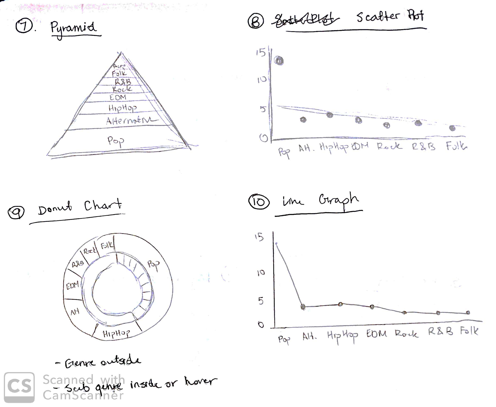
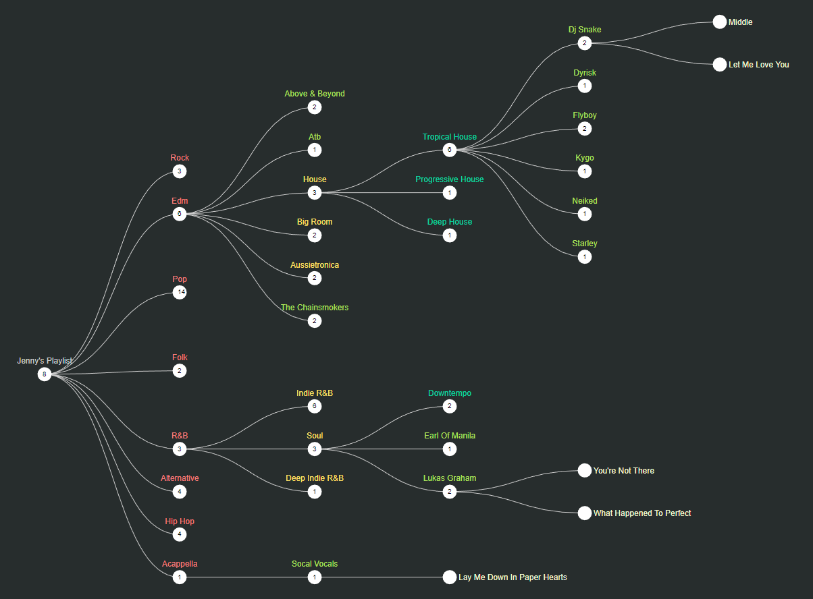
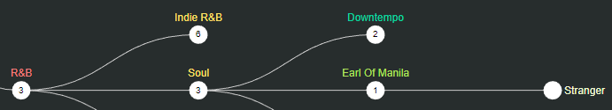
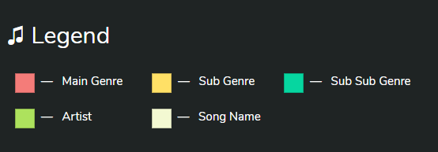
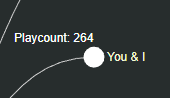
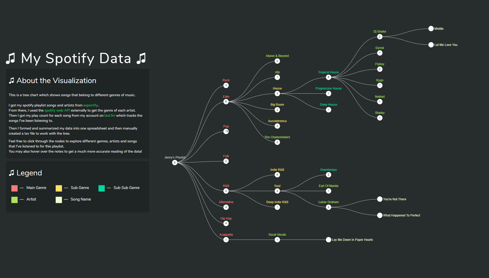

---
#### Challenge
To visualize the assigned dataset or the data set that you have had approved.
The main focus of this project is on the representation of the data.

---
#### The Data
The data chosen for this assignment is data about one of my playlists that I listen to on Spotify. I used Exportify to export a .csv of the playlist which returns the Spotify URI, Track Name, Artist Name, Album Name, Disc Number, Track Number, Track Duration (ms), Added By, and Added At information.

The reason why I wanted to visualize this data is because I am passionate about music and I thought that it would be really cool to visualize the music I’ve been recently since it is a dataset that I am interested in, which motivates me to complete this assignment more efficiently.

#### Data Summary Sheet
I summarized only the Track Name and Artist Name into a csv. Then I used the Spotify Web API to get the genres of each artist and included it in the csv. I also got my play count for each song from last.fm and added it as well.

#### Directions and Change
| &nbsp; | &nbsp; |
|:-:|:-:|
|  |  |
At first, I was completely confused about what to do with my data. There were so many genres and sub genres that I was completely overwhelmed on how to sort it all and get it into a visualization. None of the sketches stood out to me except for #5, the Tree. I decided to go with it because it was perfect for handing a lot of data, and it could also hide some data if the user doesn’t want to see it. Before I input data in the tree, I converted my csv to a tsv file since the data would be easier to process in tsv form. I intended to use not as many colours in this visualization because I still wanted to follow a simplistic appearance. I used an existing code online to help me form the tree because the type I wanted is too hard to form from scratch.

As the tree got fuller and fuller, I decided to add a hover option that lets the user see how many times I’ve listened to a song when they put their mouse over a node. Additionally, I included colours and a legend to help differentiate between different categories of data. I really like this tree and the whole appearance of the page because it is extremely simple and clean. 

---
#### Representation
I decided to do a tree which then could collapsed to browse through different nodes. The reason why I chose to do a collapsible tree is because I didn’t want to overwhelm the user with a lot of information about genres, artists, songs, etc. I wanted them to start wherever they wanted, whether it be checking out the Folk music or starting with the Pop music. I wanted this visualization to be simple, interactive and informative such that they leave knowing about which music I listen to.

---
#### Presentation

I chose to do a plain black background to go with the tree, since the links are white, and white goes well with black. And then I chose diverse colours to represent the Genre, Sub Genre, Sub sub genres, Artists and Songs. The reason why I chose diverse colours is because I wanted the user to be able to differentiate between each category. I also chose plain white nodes because I felt that it would be too much if I had even more colour. I was aiming for a simple but effective tree graph.

---
#### Interaction
Three interactive features were added to this visualization:

##### 1. Nodes

The nodes in the collapsible tree graph are the most interactive feature of this visualization. The nodes being clickable allows the user to explore and learn about songs, artists and their genres. 
Additionally, being able to click on the nodes will transition the graph and make it take on different forms, which appeals to the aesthetics features of this visualization!

##### 2. Legend

The user of the visualization will be interacting with the legend as it explains what which colour stands for in the tree. 
I think that it is extremely important for visualizations that involve the use of symbols or colours to have a legend if they represent an attribute or certain type of value. 

##### 3. Hover

Utilizing the mouse is extremely important and simple when it comes to visualizations. It’s such a small action that can show so much. For example, I included it in my visualization. 

When the user hovers over the node, the amount of times the song has been played appears top left of the node. This will let the user know how many times I’ve played this song and they’ll get the feeling that I really enjoy this song if I’ve listened to it a lot.

---
#### Positive Features

One positive feature that I like about this visualization is that the visualization’s appearance is extremely simple. I like it when colours aren’t clashing or things are overlapping each other. 

I’ve also learned to make this layout better than project 1 by moving the title to on top of the boxes on the left side of the screen. It makes the title stand out more and it also gives the visualization on the right some more breadth.

I also like how the user can explore and play around with the nodes without experiencing any trouble or difficulty. You can just simply click, hover and discover new genres!

---
#### Code
##### GitHub
GitHub Repository: <a target="_blank" href="https://github.com/Jennykuma/CPSC-583/tree/master/P2">https://github.com/Jennykuma/CPSC-583/tree/master/P2</a>

##### Working Webpage
Click: <a target="_blank" href="https://jennykuma.github.io/CPSC583/P2/index.html">https://jennykuma.github.io/CPSC583/P2/index.html</a>

---
#### Working Prototype
Youtube: <a target="_blank" href="https://youtu.be/AdZMxk9ZLD4?t=92">https://youtu.be/AdZMxk9ZLD4?t=92</a>