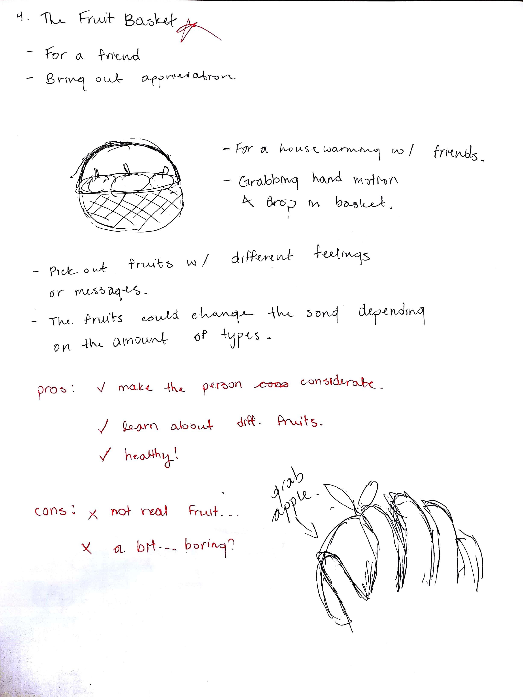

---
#### Information
###### Team Member(s) 
Jenny Le
###### Future Audience 
People who enjoy planting or like succulents. Also for those who want to reflect on themselves and their friendships. 
###### Status 
Functional prototype somewhat working
###### Language(s) & Software 
Used C#, Unity, Blender, Audacity
###### Type 
Class project
###### Schedule
Nov 16 - Dec 5 2017

---
#### Challenge
Create an interface using the Kinect V2 to create a Hygge aesthetic. 

No kawaii or holiday aspects are allowed to be in the project.

---
#### Problem Statement
Hygge. It is the Danish word used when acknowledging a feeling or moment, whether alone or with friends, 
at home or out, ordinary or extraordinary as cozy, charming or special. (Definition from http://hyggehouse.com/hygge) 

Going into this project was kind of overwhelming for me because I did not know what Hygge was, to begin with. 
I wanted to make sure the Hygge aesthetic was shown significantly because this is what our project is about. 
Whether the individual is alone or with friends, the feeling of coziness must be present. 

#### Brainstorming
This is a list of all of the ideas I could come up with through Googling and talking to some friends. 

The reason why I made a list of hygge inducing things is that I wanted to learn more about hygge and what I could do with my project.

##### Moodboard
| &nbsp; | &nbsp; |
|:-:|:-:|
|  |  |

To gain some more ideas about Hygge, I decided to go on Pinterest to look at some relatable images. While on Pinterest, I realized that Hygge images had a warm colour, leaning towards whites and yellows. 
Through this observation, I wanted to go with something green but with a hint in yellow in the colour. 

That is when I decided to search up succulents because I had some friends who were into succulents and plants. 
Succulents are simple, no drama, no harsh feelings except love and growth. I made sure that my succulent mood board would show the colour palette that succulents generally display and the atmosphere they give off. 

This is what I wanted my Hygge aesthetic to be relevant to.

---
#### Low-Fi Prototyping - Sketches
##### Initial
| &nbsp; | &nbsp; | &nbsp; | &nbsp; | &nbsp; | &nbsp; | &nbsp; | &nbsp; | &nbsp; | &nbsp; | &nbsp; | &nbsp; |
|:-:|:-:|:-:|:-:|:-:|:-:|:-:|:-:|:-:|:-:|:-:|:-:|
|  |  |  |  |  |  |  |  |  |  |  |  |
These are some sketches that I did for brainstorming what I could do for this assignment:

1. **The Gift Box** - This concept consists of an individual receiving something in the mail. From there, they will be able to interact with items within the gift box to bring up certain memories and reflect on times shared with friends and family. 

2. **A Warm Cup of Cocoa** - What's better than a warm cup of cocoa? In this simulator, the user will able to create cocoa and enjoy collaboration with the ones you enjoy spending time with! You can also create variations of cocoa and move onto coffee as well. 

3. **Outdoor Dance Party!** - Users will be able to enjoy time together through a summer hygge sensation! They can enjoy time outside and cheer each other on as they try to gain points for their team through dancing. It is a competitive and fun type of time without any drama. 

4. **The Fruit Basket** - Users will be able to pick out fruits for an occasion. This could be a friend's housewarming or a get well soon gift. By interacting with each fruit, the user will be able to reflect on themselves and think about which fruit the other person would like. 

5. **Planting Hygge!** - This is for individuals who enjoy succulents and planting. The user will be able to take care of a virtual plant and see it go through the process. It is kind of like a Tamagotchi but includes plants! 

6. **Drawing Diary** - The user will be able to enjoy this free-form drawing simulator by moving their arms in an abstract drawing motion. The user will be able to view their previous drawings after they have finished. It is a good application to allow the user to relieve stress by doodling whatever they want as well as getting some exercise in too! 

7. **Rowing in the Lake** - Users will be able to journey through a lake on their rowboat. This would consist of a breathing exercise which allows them to relieve themselves of everyday stress. Additionally, they will enjoy a scenic and serene view. 

8. **The Fireplace** - Ever seen those channels where it just shows a fireplace and the person occasionally adds in a log? Well in this simulator, the user will be able to put in the log however they want without the need to complain about how it's done on TV. It is a soothing experience for the user and those who are with the user! 

9. **Memory Book** - In this application, the user will be able to look back on memories that they've experienced in the past. It is kind of like a digital diary as they will be able to upload pictures and also include voice memos or even video memos which can be reflected on later! 

10. **Winter at a Cabin** - Two users will be able to use this application. It will consist of them being at a cabin and enjoying some games while they're there. The users will be able to use their arms and enjoy each other's company. 

11. **Hygge Session Planner** - Users who enjoy planning will enjoy using this application. The user will be able to plan what they would do in a Hygge session. To do this, they will need to add things to their planner. To these individuals, they will find Hygge in the planning itself. So it's kind of like Hygge-ception! 

12. **Hygge Zen Garden** - Instead of using a zen garden in real life, the user will be able to experience it while using the Kinect. It would be a relaxing experience where the user would be able to rearrange decorations and plants however they want. They would also use their arms to add ripples to the gravel, which allows them to customize it as much as they like! 

From the critique done in class, I decided to do a variation sketch of the Hygge Plant simulator because this idea is extremely broad, and variation sketches would help me narrow it down as to what I would want to do! Additionally, it is the closest experience dealing with succulents.

##### Variation Sketches
Some variation sketches created from some of the feedback given in critique:

###### Plant Hygge Variation Sketches
| &nbsp; | &nbsp; | &nbsp; | &nbsp; |
|:-:|:-:|:-:|:-:|
|  |  |  |  |
1. **Wave Arms Like Sun** - To include more interaction with the Kinect, I decided that waving your arms would kind of be like the sun. Thus if the user waves their arms, the plant would grow significantly. 

2. **Replacing Soil with Water** - To add some more points to aesthetics, I decided that it would be cool to replace the soil with water looking texture to see the roots of the plant and how it takes in water. 

3. **Decoration Rocks** - To include some aspects of the Zen Garden, I decided to include the feature of moving around rocks, moss, and gravel in the succulent pot. This would be Hygge in the way of feeling pleasure and satisfaction from making something pretty and amazing. This heavily leans on the satisfaction side since decorating your pot would be visually pleasing. 

4. **Choosing Your Pot** - Adding to the satisfaction and feeling of pleasure, the user can choose which pot they plant their plant in. 

5. **Engraving** - This feature is a low priority, but it could make a big difference. Engraving a message onto a pot would allow the user to include something personal and make their plant one of their own. 

6. **Gardening** - The user will be able to look back on all of the plants they've planted in the past. From there, they'll be able to reflect on the times they've planted and also their friends. 

7. **Zen Succulent** - Adding the Zen aspect to succulents, the user will be able to draw/paint while interacting with the Kinect to create graphics in the sand of the succulent. 

8. **Heartbeat Growth** - This would involve making the user get their heartbeat running. When they reach a certain threshold, then the plant will grow. 

9. **Tears of ... Joy ..** - If the user cries in real life, then the plant will receive tears as water. This will help it grow... Such a sad idea... :( 

10. **Placement of Plants** - The user will have the ability to move the plants around on the desk that they're placed on. For aesthetic aspects and the pleasure itself. 

11. **Shop for Succulent Plants** - Given that all users usually have a preference for plants, this feature will allow them to decide what they want as a succulent. This will allow them to feel more included and comfortable. Additionally, then they won't have to go through the discomfort of potting a plant they dislike. 

I only used variation #4 (Choosing your pot) as a feature in my prototype. I would have done each one of these but the time and difficulty of implementation allowed me to only follow through with #4. This is a huge regret of mine because I wanted to implement all of them!

---
#### Planting Hygge
##### About
Planting Hygge is a thought-provoking experience which causes the user to consider their friends and family while dealing with plants. The general flow of the experience is to start the user with choosing their pot to plant in. From there, they will go through a series of questions to determine which plant they will end up with as a result. Click the image below to view the concept sketch. 

##### First Storyboard
| &nbsp; | &nbsp; | &nbsp; |
|:-:|:-:|:-:|
|  |  |  |
This storyboard was drawn first to get the ball rolling. I wanted to see what the user would do, to begin with, and what they would do to end off the experience. First, the user would choose their pots and then go onto filling up their pot with materials such as gravel or soil and choosing their plant to put in. From there, they would be able to do gestures to mimic a Zen Garden within their succulent. They would also be able to water it and look back on the past plants that they have grown. Before I knew it, the direction of this storyboard would change.

##### Second Storyboard
| &nbsp; | &nbsp; | &nbsp; | &nbsp; |
|:-:|:-:|:-:|:-:|
|  |  |  |  |
This storyboard was drawn after I started to implement the program on Unity. This is a more realistic storyboard as I realized my time constraints and the difficulty when it was time to implement code. I was quite saddened by the reality of the storyboard, but if I were to work more on this project, I would try to implement most of my variations and the features in the storyboard above. The user would again start by choosing their pot, and then they would select items that correspond to the question being asked on the screen. After answering questions for a number of times, the user would then be presented with a special plant which is unique to their answers. The third image is a page of pot sketches as I was researching different pots to implement in Unity. And the fourth image is a quick layout of answer patterns that result in certain plants to show up. The first question heavily dictates which plant will be received in the end because the more times you see your friends, the more leaves the plant will appear to have.

##### Progress
youtube: <a href="https://www.youtube.com/watch?v=QHVJwD2PheY" target="_blank">https://www.youtube.com/watch?v=QHVJwD2PheY</a>

The above video shows some of the early progress I got in the implementation stage. I managed to get the left and right hand detected through the Kinect, which gives the feedback of highlighting the pot! Throughout the whole implementation process, I ran into some new obstacles such as not being able to add a delay, UI obstacles and maneuvering things in Unity. It sucks but I just had to make do with what I could do. I managed to be able to select answers on questions and make the final plants appear, as to which I was content with. Selecting pots, answering questions, adding music, and making the final plants appear. It's not much, but I am glad that I have an entry and an exit. I managed to use some sounds that I had recorded, while some others were found online.

##### If I had more time...
If I were given one more week to work on this project, I would put more time into this every day. The time spent on this project compared to my IKEA Furniture Simulator is nowhere close to that. The deadline for this project was shorter than all of the other projects for this class. I would implement features from the variation sketches as well as in the first storyboard. Such as making the soil turn into water, placing rocks and moss for decoration, and the zen features. I would also clean up the bugs and find a way to implement my code cleaner. Furthermore, I would create more of the assets instead of finding them online and also expand my decision tree to add more plants and questions.

---
##### Helpful Links
These guides and support helped me a lot!

<a target="_blank" href="https://www.turbosquid.com/3d-models/pots-sahara-plant-obj-free/548923">White Pot Object</a>

<a target="_blank" href="https://www.assetstore.unity3d.com/en/#!/content/28858">Fantasy Plant</a>

<a target="_blank" href="https://free3d.com/3d-model/indoor-plant-nr-3-6768.html">Big Plant</a>

<a target="_blank" href="https://www.assetstore.unity3d.com/en/#!/content/13283">Decorative Plants</a>

<a target="_blank" href="https://forum.unity.com/threads/how-to-hide-a-canvas-renderer.276850/">Hiding a Canvas Renderer</a>

<a target="_blank" href="https://www.youtube.com/watch?v=0qj4hgJeSe4">Maplestory Intro Song</a>

<a target="_blank" href="https://freesound.org/people/zut50/sounds/162395/">Yay Sound</a>
       
---
#### Code
##### GitHub
GitHub: <a target="_blank" href="https://github.com/Jennykuma/CPSC-581/blob/master/P3/Hand.cs">https://github.com/Jennykuma/CPSC-581/blob/master/P3/Hand.cs</a>

##### Download the Project
Executable: <a target="_blank" href="https://www.dropbox.com/s/7op96nsqo4x4l47/PlantingHygge.zip?dl=0">https://www.dropbox.com/s/7op96nsqo4x4l47/PlantingHygge.zip?dl=0</a>

Instructions:
- Download the executable and unzip it to a directory
- Simply run HyggePlanting.exe that is located in the release folder!
- Enjoy :)

---
#### Working Prototype
<iframe width="1035" height="582" src="https://www.youtube.com/embed/5kR6Y4IyoAI" frameborder="0" allow="accelerometer; autoplay; encrypted-media; gyroscope; picture-in-picture" allowfullscreen></iframe>
