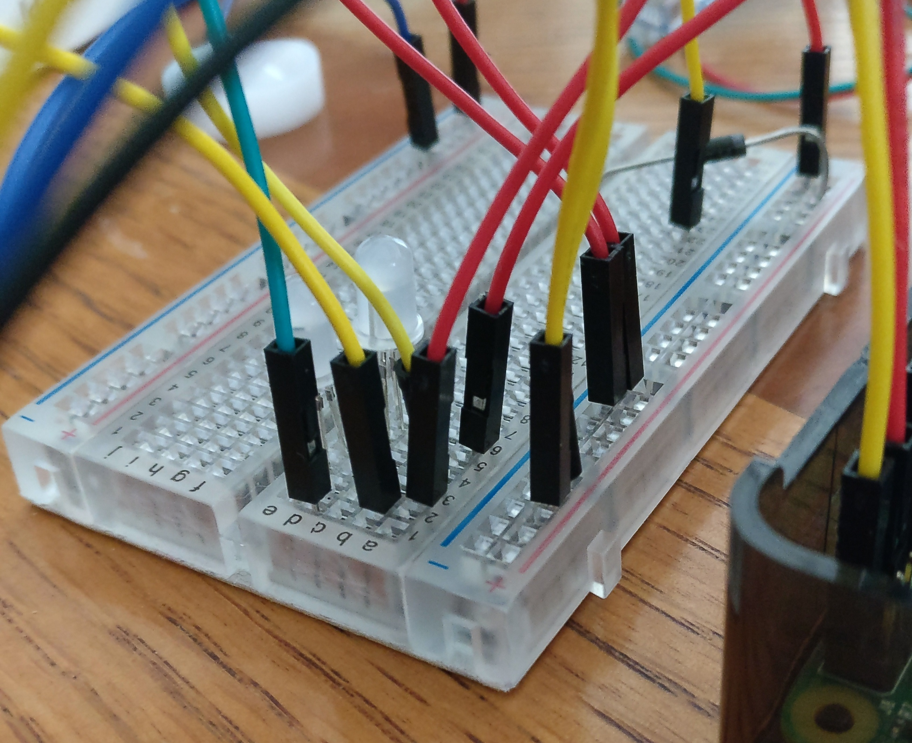

---
#### Challenge
Create an "interactive wearable accessory" that enhances the experience of its wearer. Wearable technology is on the rise, including examples of electronic fashion.

For this project, I was expected to go beyond the obvious (no watches, bracelets, or wrist-adornment),
and use physical computing (e.g., Raspberry Pi or Arduino) to create an "interactive wearable accessory".
#### Problem Statement
For this project, I wanted to bring up the problem of sexual harassment, being stalked, and feeling unsafe when you shouldn't need to. 

Harassment of all types is still a big issue in this day and age, and I wanted to do something about it. 

#### Brainstorming
Below is an image of some ideas that were listed during my brainstorming process.

#### How My Idea Came To Be
##### Talking to my best friends
I was talking to my best friends earlier in the month, and we had a discussion on how some people were being extremely creepy. 
There was some discussion of harassment and situations where they had felt uncomfortable. 
We also talked about how it would be cool to have an accessory with a camera on it, which would add a sense of security. 
This is where my idea for this project sprouted. I wanted to create something that would provide the feeling of being safe at all times. No one deserves to feel unsafe and alone.

---
#### Low-Fi Prototyping - Sketches
##### Initial
| &nbsp; | &nbsp; | &nbsp; | &nbsp; |
|:-:|:-:|:-:|:-:|
|  |  |  |  |
These are some sketches that I did for brainstorming what I could do:  
I also managed to write down some pros and cons for each idea!
1. **Gun Holsters** - I was thinking about safety holsters that would allow the user to communicate with their phone more easily. This could even count their heartbeat! 
2. **Make Up/Face Mask** - Inspired by how much I like korean skin care. This idea didn't turn out so well because water & electricity don't work well together... 
3. **Hair Clip with LED Board** - I wanted to show something that could be trendy and very lit. Customizable messages! 
4. **Hair Clip with Camera** - This is when the safety idea came into play. More directed to girls. 
5. **Dad Cap with a Camera and Speakers** - I wanted to make the camera idea more involved with guys as well, since hair clips are more for girls. 
6. **Music Cape** - I wanted to make a stylish and statement kind of cape, which looked cute as well. 
7. **Hair Bow Accessory** - Attach a camera on it, which is more directed for girls and their safety while looking pretty. 
8. **Lanyard RFID** - This is directed to people who want to get in and out of doors quick and easily. 
9. **Dragon Ball Z Reader** - As a fan of DBZ, this is definitely a wearable accessory, but it is a bit too high tech... 
10. **Hand Gesture Glove** - A glove that would have different gestures when the user does something. It is aligned with their phone.
11. **Voice Assistant Scarf** - I wanted a scarf that could be connected to my phone so I wouldn't have to take it out all the time.

** #5 stuck out the most to me. I then proceeded onto variation sketches.

##### Hat Variation Sketches
Some variations of the hat that came out of the brainstorming phase:

1. **Camera at the back** - This was definitely a must if I were to go on with the hat idea. 
2. **Music control buttons** - Similar to buttons on earbuds, but on the hat. 
3. **Lights on the rim** - To make it flashy! 
4. **Beanie hat with music control** - In case the user didn't want a cap and wanted a beanie instead. 
5. **Phone top 3 contacts** - This would allow the user to easily call their top 3 contacts instead of getting their phone out. 
6. **Top hat** - What if the user didn't want a cap or beanie?!
7. **LEDs at bottom of rim** - Would have LED blinkers for text notifications. 
8. **Have an animal patch near the camera** - So people wouldn't know that there's a camera there in the first place. 
9. **Hat with build in earbuds** - So we wouldn't have to untangle them when we get them out of our pockets. 

From this process, variations 1, 3, 5, 7 carried onto being created!

---
#### Concept Design Sketches
I drew 4 concept design sketches for 4 potential products: 
These sketches are more refined and more technique was put into the sketches to help tell a story.
##### Hat Concept

##### RFID Lanyard Concept

##### Smart Holster Concept

##### Scarf Concept

---
#### The Cap
##### About
The reason why I chose to go ahead with creating this cap because I found it more meaningful to me than the other designs. 
This fits the design brief because a cap is a wearable accessory, and the user will be able to interact with it a number of times. 
There are 3 main components that go with the cap: 
###### 1. LED Lights
The user will be able to find out if they have an email notification. There are two light patterns that notifies the user of their emails. 
1. Rainbow - The user has no new messages.
2. Blinking - The lights will blink through blue, red and green extremely fast, which will tell them that they have a new messsage.

###### 2. Buttons
There are 4 buttons on the keypad.
Buttons 1, 2 and 3 will allow the user to send a message to their chosen contacts. They can also customize the message that will be sent. 
Button 4 instructs the camera on the back of the cap to capture an image. 
###### 3. Camera
The user will be able to interact with the camera via Button 4. They can then view the image on the computer via sd card. 
###### If I had more time...
- Turn this into SMS because email messaging is not as instant and popular as sending text messages. 
- Include the image captured via Button 4 into the email so that the recipient would receive the image. 
- Upgrade the camera to a wide angle lens because it would allow the user to have a greater capture of the field of view.

##### Creating My Project
It took a lot of struggling and stress, but it paid off! I started out learning how to wire the LEDs and the breadboard in general. 
Then I did the buttons and the camera. I think it's best to show images of my project and it's progress! 
I had a lot of fun with this project even though I was in a huge time crunch. It brushed up my time management skills and was a huge challenge against stress. 

| &nbsp; | &nbsp; | &nbsp; | &nbsp; | &nbsp; |
|:-:|:-:|:-:|:-:|:-:|
|  |  |  |  |  |
##### Screenshot
Example of an email a recipient would receive:

##### Helpful Links
These guides and support helped me a lot!

<a target="_blank" href="https://learn.adafruit.com/raspberry-pi-e-mail-notifier-using-leds/python-script">Pi and Email Notifier LED</a>

<a target="_blank" href="https://learn.adafruit.com/neopixels-on-raspberry-pi/software">Pi and NeoPixel Lights</a>

<a target="_blank" href="https://stackoverflow.com/questions/38391412/raspberry-pi-send-mail-from-command-line-using-gmail-smtp-server/38391413">ssmtp and GMail</a>

---
#### Code
##### GitHub
GitHub: <a target="_blank" href="https://github.com/Jennykuma/CPSC-581/blob/master/P1/hatFinalVer.py">Click here</a>

##### Download the Project
.py download: <a target="_blank" href="https://www.dropbox.com/s/hv2ru28xcmsisom/hatFinalVer.py?dl=0">Click here</a>

Instructions: <a target="_blank" href="https://www.dropbox.com/s/wshx9selw71ycee/Instruction.pdf?dl=0">Click here</a>
        
---
#### Working Prototype
youtube: <a href="https://www.youtube.com/watch?v=wiZTTenyB3c" target="_blank">https://www.youtube.com/watch?v=wiZTTenyB3c</a>