---
#### Challenge
To visualize the assigned dataset or the data set that you have had approved.
The main focus of this project is on the representation of the data.

---
#### The Data
The data chosen for this assignment is data about the global share held by leading smartphone vendors from the 1st quarter of 2009 to the 3rd quarter of 2017. The reason why I chose this data is that I am an avid follower of smartphones and their releases. I thought that it would be cool to check out which phone company has the largest market share. And also, I thought that it would be cool to check out trends where companies have grown and diminished over time.

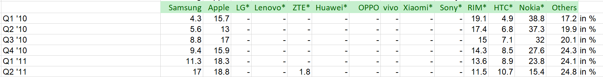

The market share data is given in %, where each quarter adds up to 100%. The data given could be easily manipulated to suit what type of visualization is desired. I decided to go with a pie chart to display these data points.

#### Directions and Change
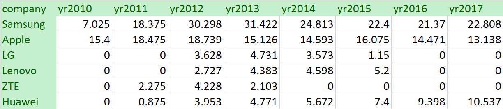
Before starting, I decided to change up the data so that it would not be in quarters, but instead, per year. The reason why I decided to do this is that it would be easier for the average person to understand the market share data rather than figuring out each quarter and adding it up. So then I decided to create a summarized .tsv file of the data to use for the visualization. I did this by adding up the values and then dividing it by 400 then multiplying it by 100 to get each data point out of 100%! 

You can find some images of my sketches below:

| &nbsp; | &nbsp; | &nbsp; | &nbsp; |
|:-:|:-:|:-:|:-:|
| 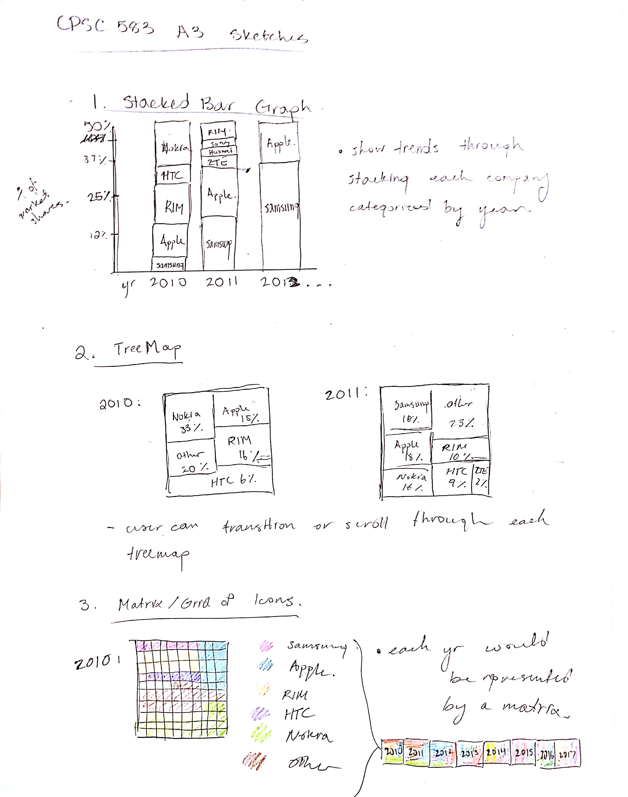 | 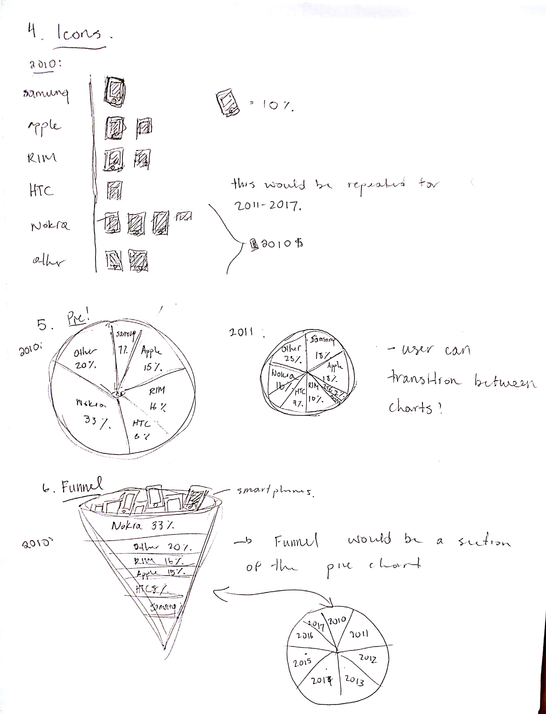 | 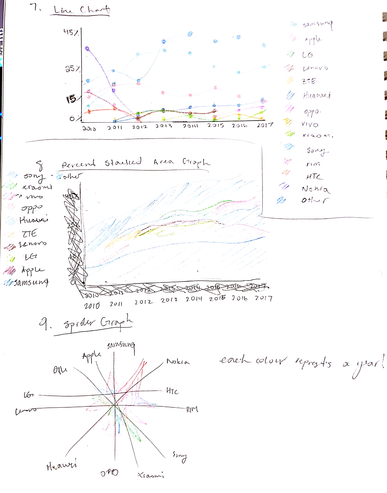 | 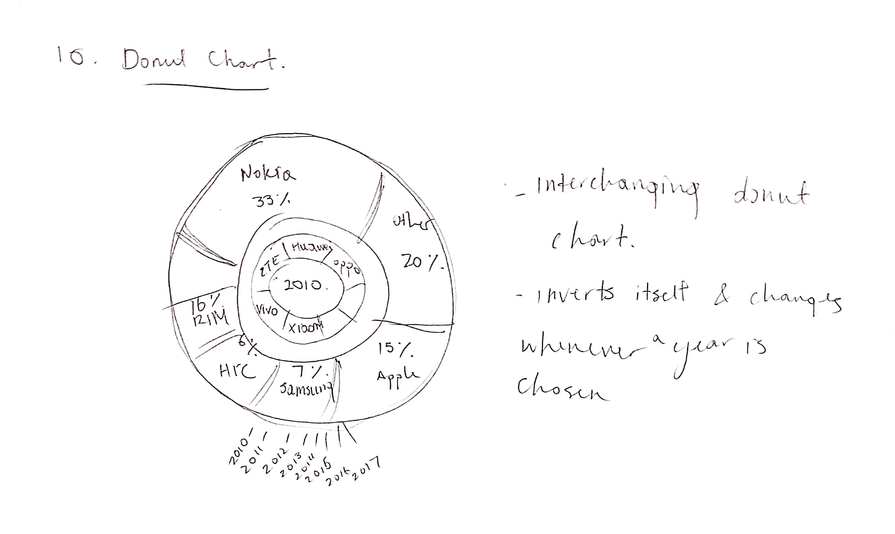 |

I decided to do a pie chart to divide it into vendors on a chart since the values all added up to 100%. After talking to Dr. Carpendale, I decided to take another approach towards this assignment and pursue a spider graph. I believe that this was better than the pie chart because it would allow different trends to be seen and the user would be able to visualize all of the data instead of viewing it one by one through pie charts.

---
#### Representation
I decided to represent the data in a spider graph because it would be easier for the user to trends within the visualization. I discussed with Dr. Carpendale about the difference between a pie chart and a spider graph, and the spider graph would allow the user to see the data as a whole instead of doing it with separate pie charts. Additionally, the data can be represented in a spider graph because different smartphone companies and their market shares would be represented by different values and points, using the effect of colours and size.

---
#### Presentation
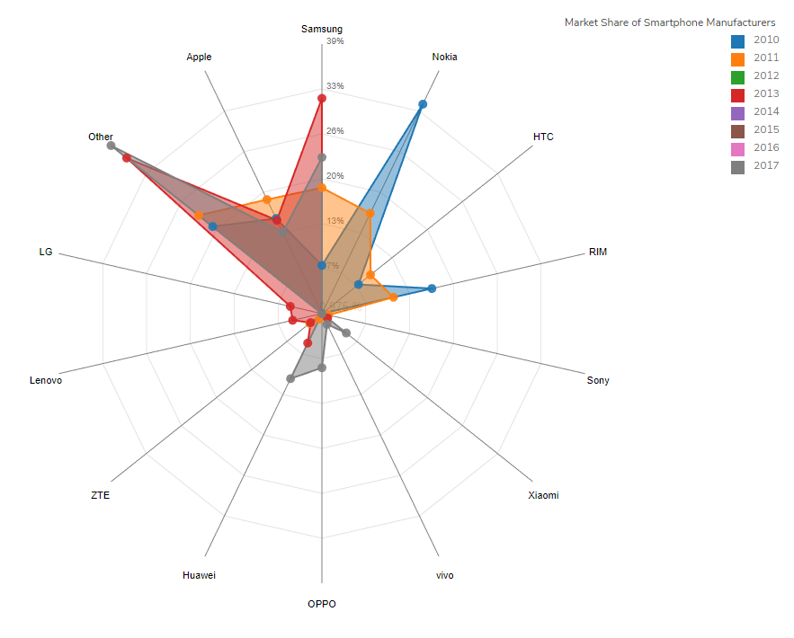
I wanted the presentation of the data to be simple but still informative. Overlapping each year of market share values for each smartphone companies allow the user to discover and see trends within the data. Additionally, by mapping each year to different colours, the user will be able to differentiate between each column of data through the assistance of the legend on the side of the visualization. Furthermore, through the mapping of the data to size accordingly, the user will be able to learn about how much market shares a certain smartphone vendor had during the specific year. I think that it is important to visualize this data through colours, size, and area because it is easy to take in shapes and sizes versus reading text on a screen. 

I also didn’t want anything to be extremely cluttered, so I made sure that there wasn’t too much going on in the visualization along with the surrounding text boxes.

---
#### Interaction
Three interactive features were added to this visualization:

##### 1. Transitions
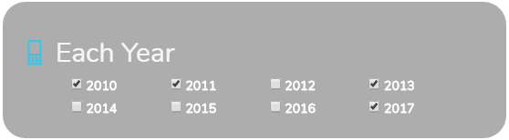
There are options on the side of the visual to help the user add data to or remove from the visualization. The user can select different years through different checkboxes to view trends and compare years.

##### 2. Legend
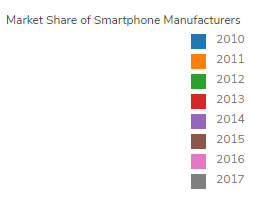
The user of the visualization will be interacting with the legend as it explains what which colour stands for what year in the visualization.
 
I think that it is extremely important for visualizations that involve the use of symbols or colours to have a legend if they represent an attribute or certain type of value. We wouldn’t want to confuse the user or anything.

##### 3. Hover
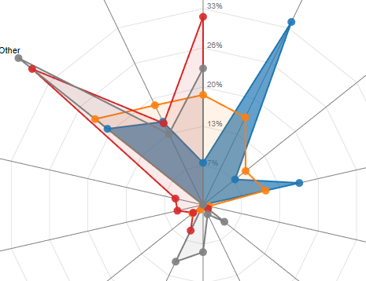
Utilizing the mouse is extremely important and simple when it comes to visualizations. It’s such a small action that can show so much. For example, I included it in my visualization. 

When the user hovers over an area of data for a certain year, all of the other years will become slightly transparent to allow the user to see what their mouse is hovering over. This is a cool effect because it allows the user to interact with the data to allow them to discover more and compare different years of data.

---
#### Positive Features
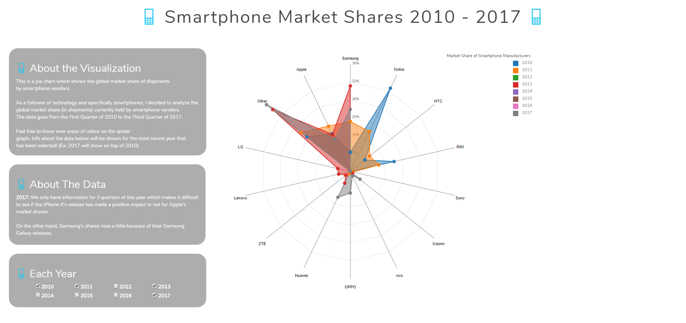
One positive feature that I like about this visualization is that the user has freedom with their interaction. They can click checkboxes to reveal different data, and then they can keep adding or removing over time. Once they check some boxes, they can also hover over the data points and the area of data itself to see it more clearly. 

Furthermore, the simplicity and use of a couple of different colours make this visualization not as cluttered. I find simplicity to be even better than having too much on a screen because I do not want to overwhelm the user at all. By using a spider graph, the user can view all of the companies at once and see their trends such as what year they peaked and when they diminished.

By looking at this visualization, I could say that I learned a lot about different trends in the market of smartphone vendors and their market shares. Such as Nokia where they had a strong start in 2010 and slowly got swept away by other Asian companies, Samsung and Apple.

---
#### Code
##### GitHub
GitHub Repository: <a target="_blank" href="https://github.com/Jennykuma/CPSC-583/tree/master/P3v2">https://github.com/Jennykuma/CPSC-583/tree/master/P3v2</a>

##### Working Webpage
Visit: <a target="_blank" href="https://jennykuma.github.io/CPSC583/P3v2/index.html">https://jennykuma.github.io/CPSC583/P3v2/index.html</a>

---
#### Working Prototype
Youtube: <a target="_blank" href="https://youtu.be/AdZMxk9ZLD4?t=175">https://youtu.be/AdZMxk9ZLD4?t=175</a>
