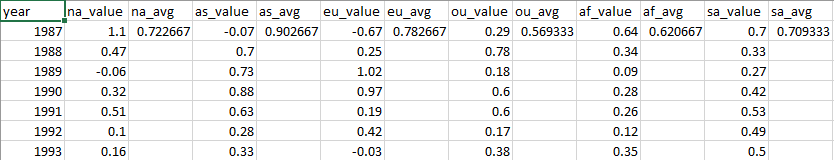
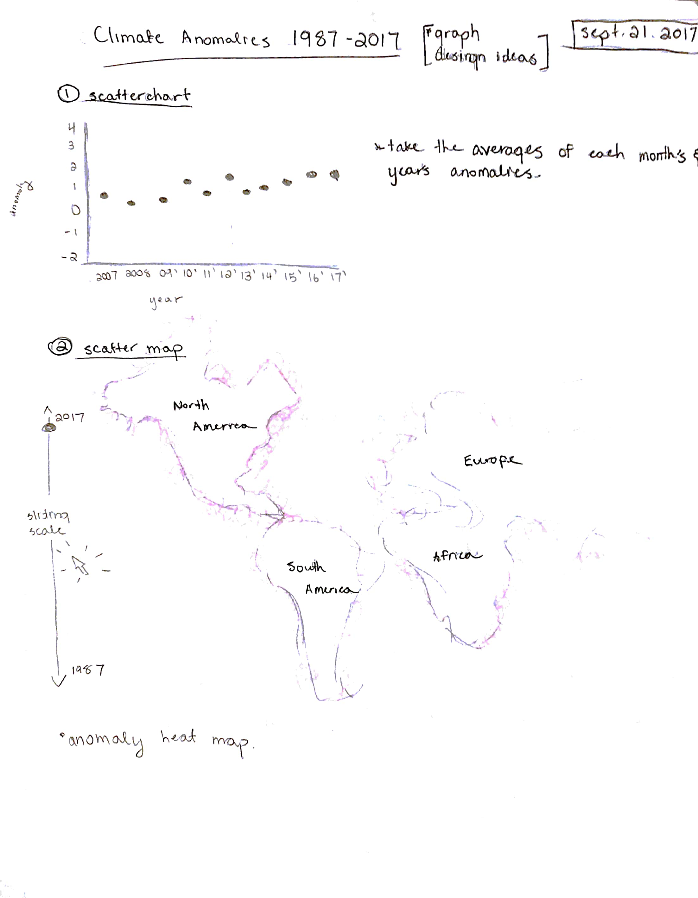
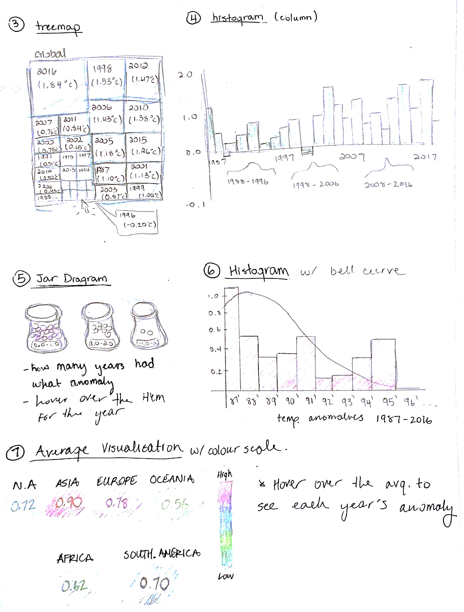
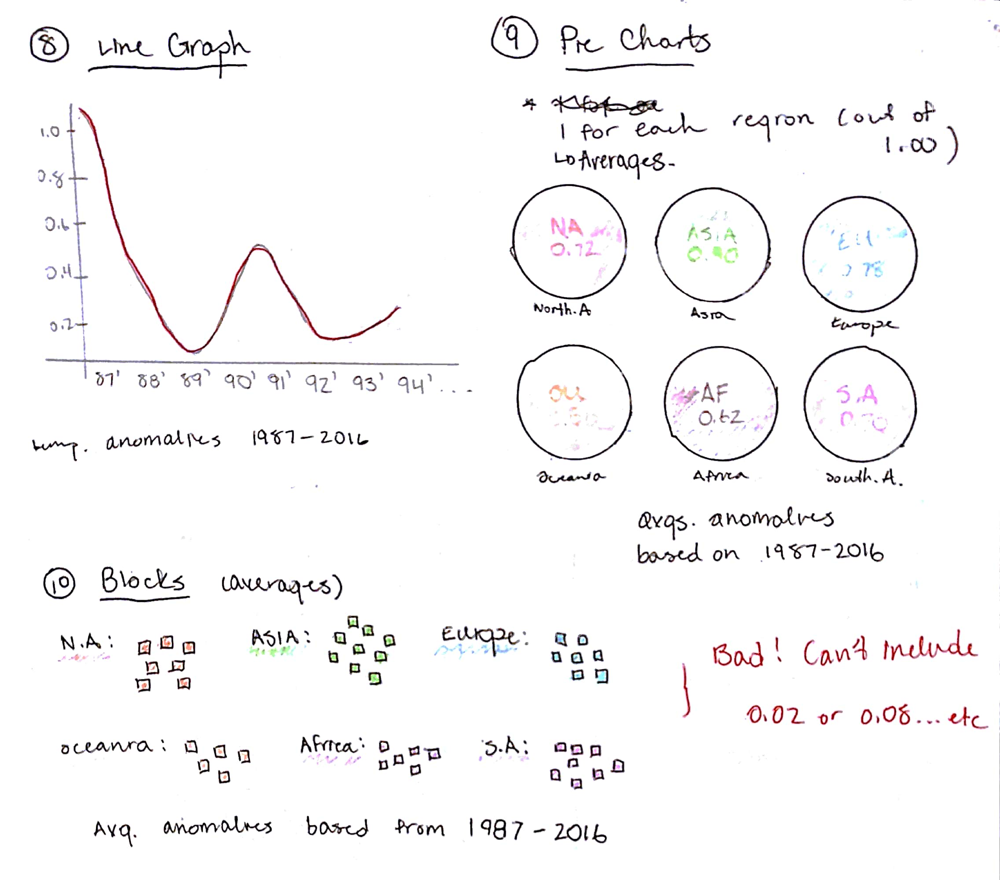
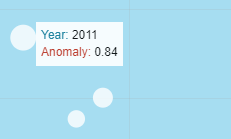
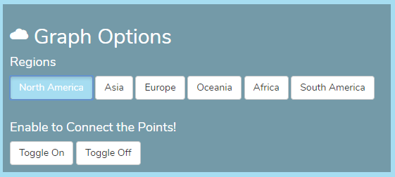
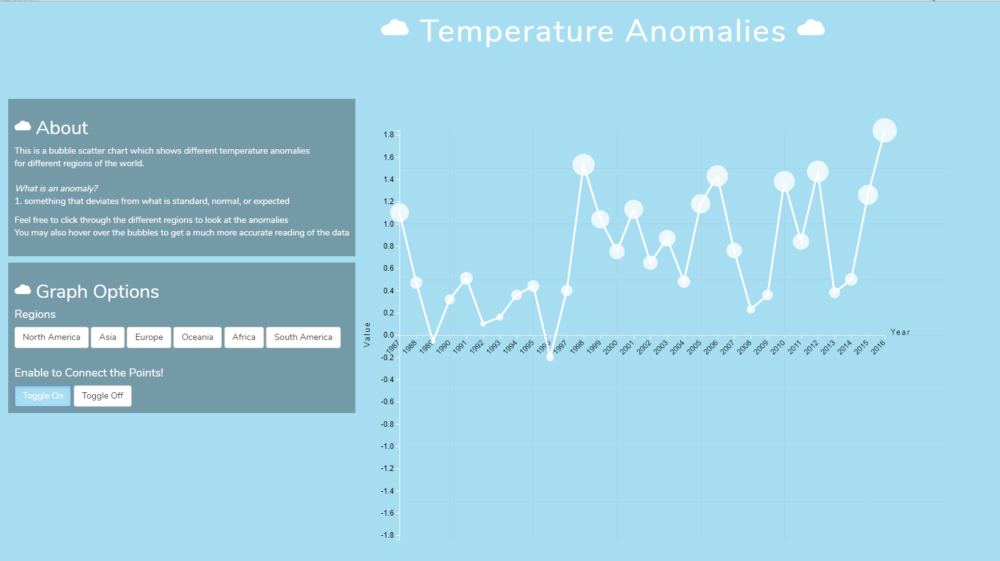

---
#### Challenge
To visualize the assigned dataset or the data set that you have had approved.
The main focus of this project is on the representation of the data.

---
#### The Data
The data chosen for this assignment is about how the climate for different regions of Earth have gotten
better/worse in terms of temperature anomalies which have deviated from the standard temperature
predicted for that time. I find it useful to visualize data based on the environment and its temperatures because it is a dramatic way to show how big global warming and environmental challenges are becoming in this day and age. If written information were to be compared with a visualization, a visualization would get to the point more drastically and accurately by a single glance. 

#### Data Summary Sheet
I took each csv file provided for each region and got their average as well and then summarized it into one csv file to use for the visualization. Originally I chose 2007-2016, but I felt that the range wouldn’t be big enough, so I stretched it to 1987-2016. 

##### Directions and Change
| &nbsp; | &nbsp; | &nbsp; |
|:-:|:-:|:-:|
|  |  |  | 
By thinking about my data, I wanted to do a bar graph or pie chart – something simple because I wasn’t quite educated on different graphs. As time in class progressed and I learned more about the aesthetic of graphs, my idea of my visualization changed. I also intended to use not as many colours because I want it modern, simple and appealing. By doing different types of sketches for a variety of graphs, I chose to do a bubble scatterplot which could also be turned into a connected scatterplot. The reason why I singled out the other graphs is because some would be too complex to do in d3, or it just did not appeal to me. I wanted something simple and pleasant so that the user would not feel overwhelmed when viewing my visualization. I fused sketches #1 & #8 since I thought they would work well together.

The scatterplot would first start out plotting the North American anomalies. But after viewing it in my browser, I thought that this would not be enough to hand in for marks. I started to branch out into viewing anomalies from other regions of the world. And then I thought to myself that it would be an awesome idea to incorporate their anomalies into the visualization because it would become interactive and it would be a gateway into opening up the idea of global environmental challenges for the user to see. I also decided to change the radius of the data points as the anomalies became greater to emphasize how much bigger the deviation is from the standard predicted temperatures. And to add more accuracy, I added the feature of hovering over each data point, which would let the user see each year and anomaly much easier.  From there, I accidentally ran into the feature of connecting the data points. I then dove further into this idea because it would benefit the user and the visualization as well, since it would let them see the differences between each anomaly. Additionally, it would add another interactive feature to the visualization. At this point, everything came together to become what the final product is right now.

---
#### Representation
I decided to do a bubble scatterplot which then could be connected to create a connected scatterplot. The reason why I started out with a scatterplot is because I wanted to map each anomaly to the year. This would then let the user see which anomaly belongs to which year in an aesthetic style. Then from there, I decided to add the option to create a connected scatterplot because it would then allow the user to see further deviation of the anomalies from the predicted temperatures. It would allow the user to compare more and see the effects of global environment challenges that are slowly creeping on us. 

---
#### Presentation
I wanted the whole site and visualization to be relative to each other. I chose a pastel blue background to go with white because I think of the colour blue when I think of the weather (blue sky, etc). I then also chose a round white font to go with the cloud symbols in the title and subtitles. 

For the data points, I chose white circles to go along with the theme. It adds a certain bounciness and closeness to the clouds on the visualization as well. The user can also see that the circles get bigger as the anomalies deviate more from the standard temperature. I chose to do a scatterplot as I wanted it to look aesthetically pleasing and it differs from a standard bland bar graph or line graph. 

Additionally, I added a negative y-axis to the visualization to also display the negative anomalies in some regions. I wanted to also make sure that the positive y-axis is symmetric to the negative y-axis for aesthetic reasons. As the user views this visualization, they should be able to conclude that the circles are getting higher later in the years as a whole. 

---
#### Interaction
Three interactive features were added to this visualization:

##### 1. Hover

If the user hovers over the data points, then a more accurate reading of the anomaly and year will be displayed. I implemented this capability because I wanted to make sure that the user knew which year is correlated to which anomaly, since the user may or may not have difficulty locating which information goes with which data point. 

I incorporated two colours such as red and blue to differentiate between the anomaly and year. The main thing that I was aiming for with this implementation was simplicity. The user shouldn’t go through any trouble trying to read the visualization.

##### 2. Regions
To make this visualization more interactive, I wanted to include various regions on the Earth. I felt that if I originally just had North America, then it wouldn’t be so interesting. Additionally, adding regions would allow the user to see how North America is doing compared to other parts of the world. I’ve included most regions/continents that are significant and would help get the message through about how global environmental challenges are arising. 

Clicking various regions also allows the user to see transitioning between data points. Even having a transition would be something interesting to see as it catches the user’s eye most of the time. When a region is selected, it will be highlighted to help the user know which region they are viewing.

##### 3. Connected Scatterplot

I stumbled upon this feature while I was trying to make a line of best fit for the graph. Instead, I was interested in connecting the data points. I like this feature because it aids the user in seeing the jumps between anomalies in the visualization.

---
#### Positive Features

One positive feature that I like about this visualization is that the whole appearance is not too overwhelming and comes off as pleasant. I chose to use very little variety of colours to keep it calming and simple. 

There aren’t too many options to choose from, which lets the user become more comfortable with playing around with the visualization. Also, there is a description on how to use the visualization on the left in the ‘About’ section in case they don’t know what an anomaly is or where to start.

I also really like the option to create a connected scatterplot with the data points plotted on the graph. This aides the user in seeing which point comes after another in terms of anomalies and years. Everything blends together smoothly!

---
#### Code
##### GitHub
GitHub Repository: <a target="_blank" href="https://github.com/Jennykuma/CPSC-583/tree/master/P1">https://github.com/Jennykuma/CPSC-583/tree/master/P1</a>

##### Working Webpage
Visit: <a target="_blank" href="https://jennykuma.github.io/CPSC583/P1/index.html">https://jennykuma.github.io/CPSC583/P1/index.html</a>

---
#### Working Prototype
Skip to 0:10

<iframe width="1035" height="582" src="https://www.youtube.com/embed/AdZMxk9ZLD4" frameborder="0" allow="accelerometer; autoplay; encrypted-media; gyroscope; picture-in-picture" allowfullscreen></iframe>